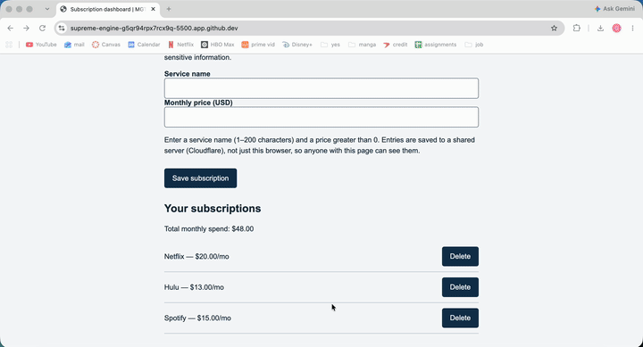
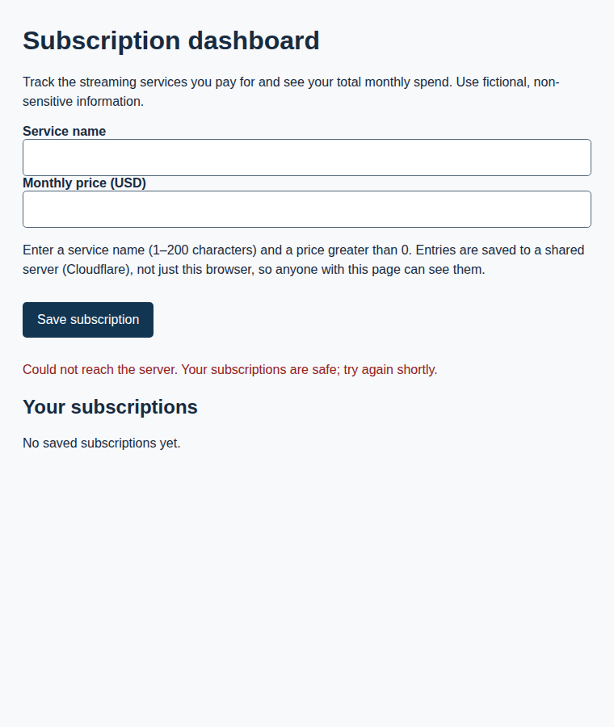
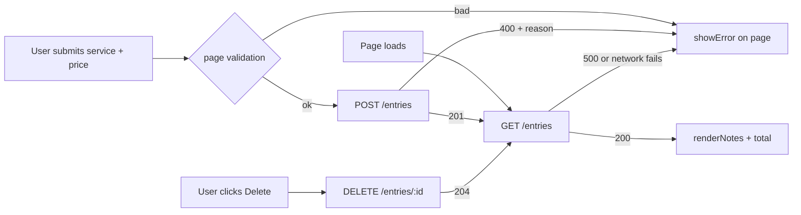

# Cost Tracker: Subscriptions Leave the Browser

## What

HW3 repository: [GiancarloMartinez-Saldana/mgt3745-hw3](https://github.com/GiancarloMartinez-Saldana/mgt3745-hw3)

Streaming viewers lose track of what they pay for: both people I interviewed
guessed low on their own subscription count ([PROJECT.md](context/PROJECT.md),
[USERS.md](context/USERS.md)). This page implements F-01/F-05 from
[FEATURES.md](context/FEATURES.md). You enter each service and its monthly
price, and the dashboard keeps a running total of your monthly spend. In HW3
the list lived in one browser's localStorage. **As of HW4 it lives in
Cloudflare D1 behind a small Worker, so it survives a cleared cache and shows
up in any browser** ([ADR-002](context/ARCHITECTURE.md#adr-002-entries-move-from-localstorage-to-cloudflare-d1)).

## See It Work

The GIF shows three subscriptions saved to D1 ($48.00), then all site data
cleared and the page reloaded: the list and total come back from the
server. Deleting one recalculates the total to $35.00.



*Recorded against `npm run dev` (the same `worker.js` on wrangler's local D1
emulator), since this GIF was made before the Cloudflare deploy. Replace it
with a recording against the deployed URL once it's live.*

Server unreachable, simulated with `?serverDown`:





## How to Run

Deployed: <https://mgt3745-hw4.mgt3745-hw4-giancarlo.workers.dev/entries> ← replace with the URL `npx wrangler deploy` prints. It should return `[]` or a list of entries, never an error.

From a fresh Codespace:

1. Open the repository in a Codespace. The devcontainer installs xdg-utils and runs `npm install`.
2. `npx wrangler login --device`, then follow [docs/SESSION_B_COMMANDS.md](docs/SESSION_B_COMMANDS.md):
   - `npx wrangler d1 create mgt3745-entries`, then paste the printed `database_id` into `wrangler.toml` in place of `PASTE_ID_HERE`.
   - `npx wrangler d1 execute mgt3745-entries --remote --file=schema.sql`. The table stores `service` and `price`, not the template's `text`.
   - Add your Live Server origin (Ports tab, port 5500, e.g. `https://<codespace-name>-5500.app.github.dev`) to `ALLOWED_ORIGINS` in `worker.js`, then `npx wrangler deploy`.
3. Paste the deployed URL into `app.js` as `deployedApi`.
4. Right-click `index.html`, choose **Open with Live Server**.

Test a POST without the page:

```bash
curl -X POST https://mgt3745-hw4.<your-subdomain>.workers.dev/entries \
  -H 'content-type: application/json' -d '{"service":"Netflix","price":20}'   # 201
curl -X POST https://mgt3745-hw4.<your-subdomain>.workers.dev/entries \
  -H 'content-type: application/json' -d '{"service":"Netflix","price":0}'    # 400 price must be a number greater than 0
```

To run everything locally instead: `npx wrangler d1 execute mgt3745-entries --local --file=schema.sql`, then `npm run dev` (port 8787), then serve the page on `127.0.0.1:5500`. A page served from localhost talks to the local Worker automatically. Add `?serverDown` to the page URL to test the outage message.

## Status

| Feature | EARS statement | Verdict |
|---|---|---|
| Save a subscription | WHEN a valid subscription is submitted, THE SYSTEM SHALL store it on the server and confirm it on the page | PASS (local) |
| Reject a bad price (HW4 rule) | IF a submitted price is not a number greater than 0, THEN THE SYSTEM SHALL reject it and say why | PASS (local) |
| Reject a bad name | IF the service name is missing, empty, or longer than 200 characters, THEN THE SYSTEM SHALL reject it and say why | PASS (local) |
| Survive cleared cache | THE SYSTEM SHALL return stored subscriptions to any browser, including one whose site data was cleared | PASS (local) |
| Delete updates total | WHEN the user removes a subscription, THE SYSTEM SHALL delete it on the server so the total no longer includes it | PASS (local) |
| Network down / 500 / 400 | IF the server can't be reached or returns an error, THEN THE SYSTEM SHALL tell the user on the page | PASS (local) |
| Two clients, one table | Private per-user lists | DEFERRED (ADR-002 → ADR-003) |
| Renewal date (HW3 #5) | Where a renewal date is given, THE SYSTEM SHALL display it | FAIL (not built, unchanged from HW3) |

"Local" means walked against `npm run dev` on 9/24. The full verification
table, including SQL injection, XSS, and CORS checks, is in
[FEATURES.md](context/FEATURES.md#hw4-verification).

## Links

- HW3 repository (as submitted): <https://github.com/GiancarloMartinez-Saldana/mgt3745-hw3>
- Deployed Worker: <https://mgt3745-hw4.mgt3745-hw4-giancarlo.workers.dev>

Reading order for a stranger: [PROJECT.md](context/PROJECT.md) →
[USERS.md](context/USERS.md) → [FEATURES.md](context/FEATURES.md) →
[ARCHITECTURE.md](context/ARCHITECTURE.md) → [STANDARDS.md](context/STANDARDS.md) →
[TOOLS.md](context/TOOLS.md) → [STYLE.md](context/STYLE.md) →
[CLAUDE.md](context/CLAUDE.md)

## AI Use

**What did the agent write?** Claude Code
- made a checklist for all the tasks I needed to accomplish
- helped fix my error when I couldn't get the website to load in
- dragged my hw-3 files into the codespace
- helped me find an app to screen record to create a gif for my "see_it_work" in vscode. Moving them into .vscode was a mistake that claude also helped me fix :)

**What was checked, and how?** 
- I ran the website immediately proceeding Claudes requested fixes and tweaked anything necessary
- I used Kap to screen record my gif and it worked flawlessly thanks to claudes recomendation to keep the graphics low for storage purposes
- I checked my codespace and it transferred all the files correctly

**What could not be fully verified?** 
- I tried to use cowork when it helped me transfer my files and it worked but on a different branch so I had to pull that info into main. After that I deleted the old branch, but I don't know if that does anything I asked google and claude and they said it has no affect and there was none that I could see, but it just felt off I need to learn to prompt that better. 

Hours spent: 13.
