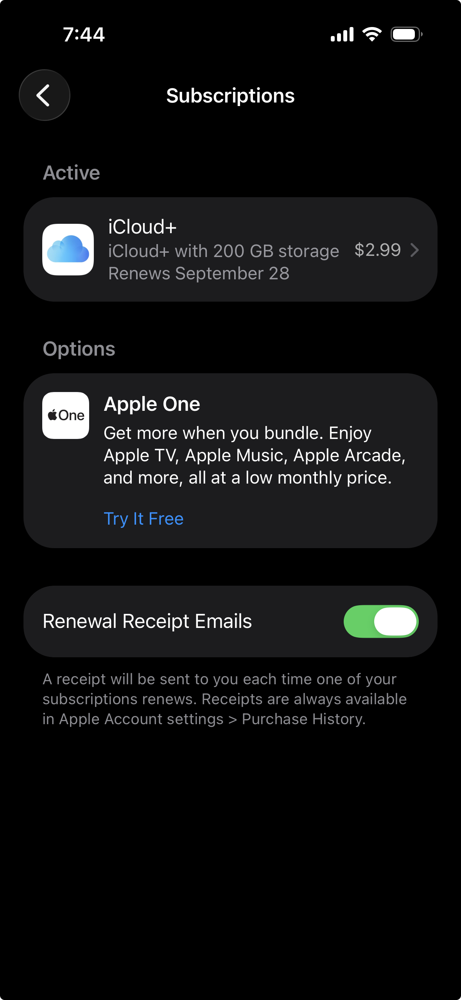
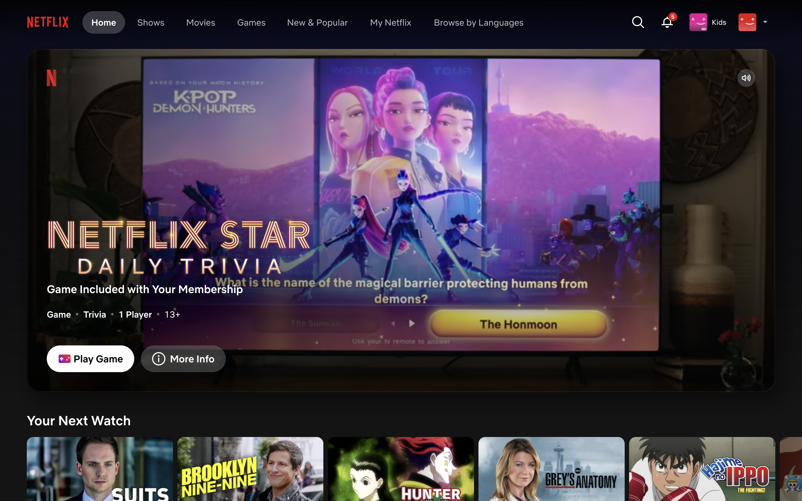

# STYLE.md

Tokens above, rationale below. The frontmatter is what a machine reads; this
body is what a human reads. One sentence per token.

## Rationale

- **color-primary** (`#123552`): a dark navy for the only action on the page (Save/Delete), because white text on it is 12.7:1 and it reads as "money and records," not "entertainment."
- **color-text** (`#172B40`): near-black blue instead of pure black, which keeps 13.7:1 contrast on the background while matching the primary.
- **color-background** (`#F7F9FB`): an off-white so a long list of subscriptions doesn't glare, and still a light surface that every other color is checked against.
- **color-focus** (`#B16D00`): amber focus outlines, used only for keyboard focus, because 3.9:1 on the background clears the 3:1 non-text minimum while no other element uses the color.
- **color-error** (`#922020`): dark red at 8.1:1 for error messages only, never for decoration, so red on this page always means "your entry was not saved."
- **color-border** (`#526578`): input borders at 6:1 against white so the fields are findable by people with low vision (WCAG 1.4.11).
- **font-body**: one system sans-serif for everything, because a dashboard of names and prices needs no second family and loads with zero network requests.
- **font-size-min** (`16px`): nothing smaller than the browser default, because prices are the whole point and the users check them on phones.
- **target-min** (`44px`): every button is at least 44px tall, so Delete is as easy to hit as Save.
- **radius** (`0.3rem`): a slight rounding so controls look clickable without looking like toys.

## Refusals

Things this interface will never do, and why. Taken from the interface I
resent: a streaming service's home screen and its cancel flow, the same
places my interviewees described getting stuck (USERS.md, INT-01/INT-02).

1. **No autoplaying previews or auto-advancing countdowns.** A dashboard about what you pay should not also be competing for your attention while you read it. Breaks: **Cognitive Load** (every moving tile adds extraneous load to a decision the user is already struggling with).
2. **Delete is never smaller, lower-contrast, or further away than Save.** Streaming cancel flows bury the exit behind extra screens and grey links; here removing a subscription is one full-size button next to the thing it removes. Breaks: **Fitts's Law** (time to hit a target grows with distance and shrinks with size; hiding the exit is making it slow on purpose).
3. **No surprise modals.** Errors appear inline under the form, where the user is already looking, and never block the page. Breaks: **Jakob's Law** (people expect a form to report problems next to the field, the way every other form they use does).

## Sources

- Admired: iPhone Settings → Subscriptions: a calm, plain list of each service and its price, nothing autoplaying, the same job my dashboard does 
- Resented: Netflix home screen: the autoplaying preview banner competes for attention while you're deciding what to watch )
